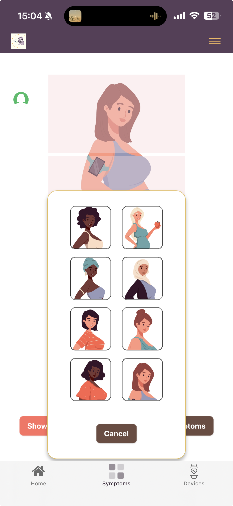
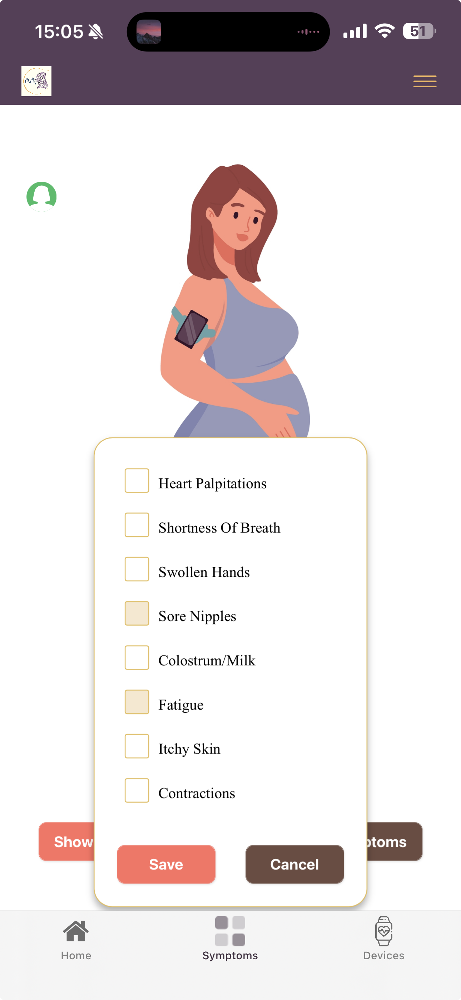
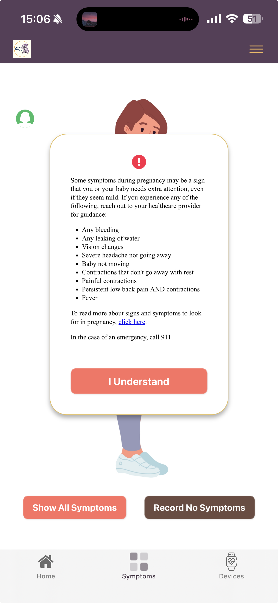

# Symptom Girl

A pregnancy symptom tracking application integrated with MyDataHelps for healthcare data collection.

## Demo

[Watch Demo Video](assets/recording.MP4)

## Screenshots

<p align="center">
  
  
  
</p>

## Overview

Symptom Girl is an interactive web application designed to help pregnant individuals track and report their symptoms through an intuitive, body-region-based interface. The application provides a visual way to select symptoms by body region and records them for healthcare monitoring.

## Features

- **Interactive Body Region Selection**: Click on different body regions to view and select relevant symptoms
- **Customizable Avatars**: Choose from 8 different avatar options for a personalized experience
- **MyDataHelps Integration**: Seamless integration with CareEvolution's MyDataHelps platform for secure data storage
- **Educational Disclaimer**: Important pregnancy warning signs and emergency guidance
- **No Symptoms Recording**: Option to record when no symptoms are present
- **Visual Feedback**: Celebratory confirmation when symptoms are successfully saved

## Technology Stack

- HTML5
- CSS3
- JavaScript
- [MyDataHelps JavaScript SDK](https://developer.mydatahelps.org/) (v3.27.0)
- TypeScript (v5.8.3)

## Getting Started

### Prerequisites

- A modern web browser
- MyDataHelps project credentials (for data recording functionality)

### Installation

1. Clone the repository
2. Open `index.html` in a web browser, or
3. Deploy using AWS Amplify (see `amplify.yml` for configuration)

## File Structure

```
mdh-symptom-girl/
├── index.html          # Main application page
├── experimental.html   # Experimental features
├── script.js          # Core application logic
├── style.css          # Styling
├── font.css           # Custom font definitions
├── amplify.yml        # AWS Amplify deployment configuration
├── customHttp.yml     # Custom HTTP headers configuration
├── img/               # Image assets
└── package.json       # Node dependencies
```

## Usage

1. **Select Avatar**: Click the user icon in the top-right to choose your avatar
2. **Choose Region**: Click on one of the four body regions to see relevant symptoms
3. **Select Symptoms**: Check the symptoms you're experiencing
4. **Record**: Submit your symptoms or record no symptoms
5. **Confirmation**: Receive visual confirmation of successful recording

## Important Health Information

The application includes critical pregnancy warning signs that require immediate medical attention:
- Any bleeding
- Any leaking of water
- Vision changes
- Severe headache not going away
- Baby not moving
- Contractions that don't go away with rest
- Painful contractions
- Persistent low back pain AND contractions
- Fever

For emergencies, always call 911.

For more information, visit the [CDC's Maternal Warning Signs](https://www.cdc.gov/hearher/maternal-warning-signs/index.html).

## Security

The application implements required security headers for MDH and Amplify deployment, configured in `customHttp.yml`.
